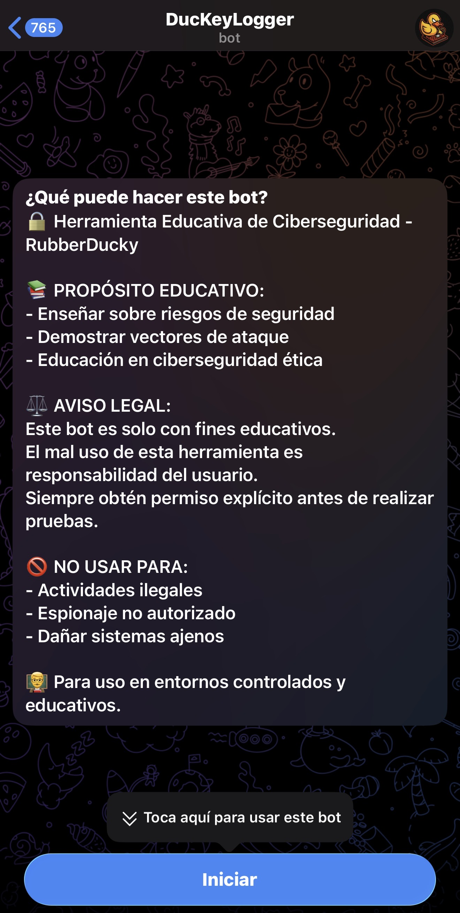
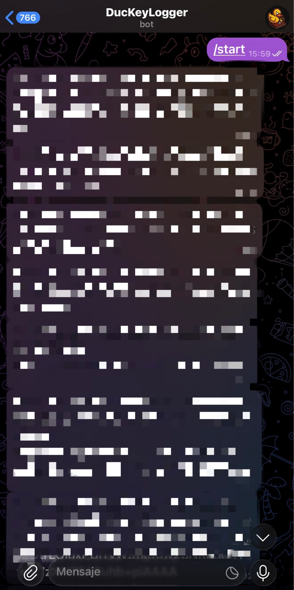
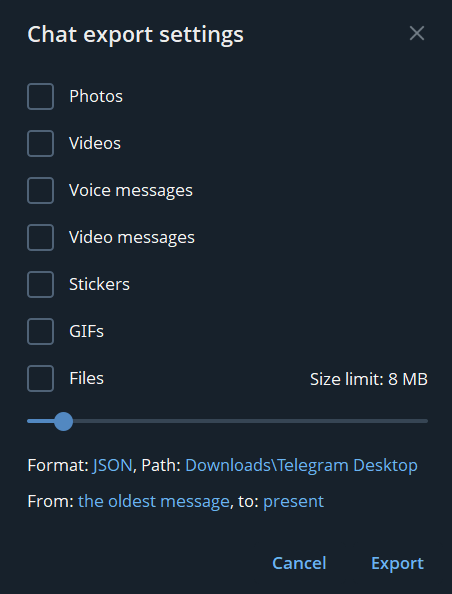
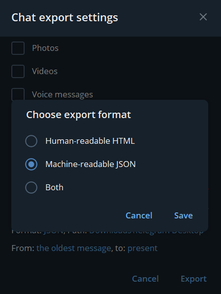

# DucKeyLogger — Keylogger usando un USB Rubber Ducky de Hack5 - Herramienta Educativa de Ciberseguridad

> **Aviso**: Este proyecto está diseñado **exclusivamente** para fines educativos y de concienciación en ciberseguridad, en **entornos controlados** y con **permiso explícito** de todas las partes. **No** está pensado para uso malicioso ni para monitorizar sistemas ajenos.

## 🧭 Descripción del proyecto
**DucKeyLogger** es un proyecto didáctico que muestra **riesgos** y **vectores de ataque** asociados a la captura de pulsaciones y a la **exfiltración de datos** hacia un canal de mensajería (por ejemplo, un bot de Telegram). El objetivo es **aprender a detectar**, **mitigar** y **auditar** este tipo de amenazas.

El repositorio incluye materiales y guía visual para **demostrar** (de forma controlada) cómo podrían aparecer registros de eventos en un canal de Telegram, así como el **proceso de exportación** de dichos mensajes para su análisis forense.

## 🎯 Objetivos educativos
- Concienciar sobre los riesgos de registrar entradas de teclado y su envío a terceros.
- Explicar un **flujo de trabajo de auditoría**: desde la aparición de mensajes en Telegram hasta su **exportación** a **JSON** para su análisis.
- Reforzar **buenas prácticas defensivas** y controles de seguridad.

## ⚖️ Uso responsable / Legal
- Utilízalo solo en equipos de laboratorio o con autorización formal.
- Evita recopilar datos reales o sensibles; emplea **datos simulados** para las prácticas.
- Respeta la normativa local (RGPD/Ley Orgánica de Protección de Datos u otras que apliquen).

## 🧩 Arquitectura (alto nivel)
1. Equipo de pruebas genera **eventos de ejemplo** (no sensibles).
2. Los eventos se envían a un **canal/bot de Telegram** para su demostración didáctica.
3. Desde **Telegram Desktop** se realiza la **exportación a JSON** de la conversación.
4. Se analiza el JSON exportado con herramientas forenses/DFIR en un entorno controlado.

> Este repositorio **no** proporciona código operativo para capturar entradas ni instrucciones para su despliegue encubierto. La finalidad es **mostrar y analizar** evidencias en un entorno de laboratorio.

## 🔧 Requisitos mínimos (entorno de laboratorio)
- Cuenta de Telegram y un bot creado con **@BotFather** (para pruebas controladas).
- **Telegram Desktop** para exportar el chat.
- Herramientas de análisis (por ejemplo, Python/Excel/ETL) para tratar el JSON exportado.

## ▶️ Puesta en marcha (solo demostración)
1. Crea un **bot de Telegram** y obtén su **token** (no lo compartas).
2. Crea un **chat privado** con el bot o añade el bot a un grupo **de laboratorio**.
3. Envía **mensajes de ejemplo** al bot (texto simulado) para generar material de práctica.
4. Sigue los pasos de exportación (sección siguiente) y analiza el **JSON** en frío.

> Sugerencia didáctica: genera mensajes con cadenas **simuladas** (no reales) para probar búsquedas, filtros y detección de patrones durante el análisis.

## 🗂️ Exportar el chat a JSON (Telegram Desktop)
1. Abre Telegram Desktop y entra en el chat del bot o grupo de laboratorio.
2. Abre el menú **⋯** → **Export chat history** / **Exportar historial del chat**.
3. Elige **Machine‑readable JSON** como formato de exportación.
4. Confirma y espera el mensaje de **éxito**. Obtendrás un archivo `.json` para su análisis.

Las capturas siguientes ilustran el proceso.

## 📸 Guía visual

### Interacción en Telegram (dos imágenes en una sola fila)
<!-- Dos imágenes en la misma fila -->
<table>
  <tr>
    <td width="50%">
      
      <p align="center"><em>Mensaje de inicio de Telegram</em></p>
    </td>
    <td width="50%">
      
      <p align="center"><em>Ejemplos del chat con los logs del keylogger (censurados)</em></p>
    </td>
  </tr>
</table>

### Exportación del chat a JSON (tres imágenes en la misma fila)
<!-- Tres imágenes en la misma fila -->
<table>
  <tr>
    <td width="33%">
      
      <p align="center"><em>Paso 1 – Abrir exportación</em></p>
    </td>
    <td width="33%">
      
      <p align="center"><em>Paso 2 – Elegir JSON</em></p>
    </td>
    <td width="33%">
      
      <p align="center"><em>Paso 3 – Éxito de exportación</em></p>
    </td>
  </tr>
</table>


## 🔎 Ejemplo: decodificar con el traductor (`decoder-B64`)

En la misma carpeta que este `README.md` hay un directorio llamado `decoder-B64/` con un traductor/decodificador en Python para procesar el JSON exportado de Telegram y producir un texto legible.

**Estructura esperada:**
```
DucKeyLogger/
├── 🧩 Ducky Encoder.html       # Utilidad local para codificar scripts Ducky
├── ⚡ execute.bat              # Lanzador/automatización en Windows
├── 🦆 inject.bin               # Payload compilado (Rubber Ducky)
├── 🛡️ keylogger.ps1           # PoC educativa de registro de pulsaciones
├── 📝 README.md                # Descripción y notas del proyecto
└── 📂 decoder-B64/             # Utilidades de decodificación Base64
    ├── 🐍 decoder.py           # Script de decodificación
    ├── 📥 entrada.json         # Ejemplo de entrada
    └── 📤 salida.txt           # Salida generada
```

**Pasos:**  
1) Exporta la conversación desde **Telegram Desktop** en formato **Machine-readable JSON** (ver sección de capturas).  
2) Copia el archivo exportado como `decoder-B64/entrada.json`.  
3) Ejecuta el traductor para generar `decoder-B64/salida.txt`.

**Comandos de ejemplo:**

Windows (PowerShell):
```powershell
cd decoder-B64
python .\decoder.py -i .\entrada.json -o .\salida.txt
```

Windows (CMD):
```
cd decoder-B64
python decoder.py -i entrada.json -o salida.txt
```

Linux / macOS:
```bash
cd decoder-B64
python3 decoder.py -i entrada.json -o salida.txt
```

> Si tu `decoder.py` admite entrada/salida por **STDIN/STDOUT**, también puedes usar:
```bash
cd decoder-B64
python3 decoder.py entrada.json > salida.txt
```

**Resultado esperado (`salida.txt`):**
```
DucKeyLogger ACTIVADO - 11/18/2025 16:57:46
CAMBIO DE APLICACIÓN: Outlook - Bandeja de entrada -> Bloc de notas - notas.txt
NUEVA VENTANA: Bloc de notas - notas.txt - notas.txt
[VS Code] escribiendo: "mensaje: revisa el mail, porfa"[ENTER]
CAMBIO DE APLICACIÓN: GitHub - Pull Requests -> Visual Studio Code
NUEVA VENTANA: Visual Studio Code - Edge
NUEVA VENTANA: Login - outlook.com - Brave
[mail.proton.me - Brave] username: marichu.private@proton.me
[mail.proton.me - Brave] password: Pa$$w0rd-XYZ
[mail.proton.me - Brave] Iniciar sesión [CLICK]
LOGIN: mail.proton.me | usuario=marichu.private@proton.me | resultado=success
NUEVA VENTANA: Login - github.com - Chrome
[github.com - Chrome] username: marichu@gmail.com
[github.com - Chrome] password: S3gura!2025
[github.com - Chrome] Iniciar sesión [CLICK]
LOGIN: github.com | usuario=marichu@gmail.com | resultado=success
CAMBIO DE APLICACIÓN: Visual Studio Code -> Explorador de archivos
NUEVA VENTANA: Explorador de archivos - Edge
NUEVA VENTANA: Nueva pestaña - Edge
[DuckDuckGo - Edge] tutorial receta tortilla de patata [ENTER]
NUEVA VENTANA: tutorial receta tortilla de patata - Buscar con DuckDuckGo - Edge
NUEVA VENTANA: Login - github.com - Edge
```
Este fichero contiene los textos **ya decodificados** (por ejemplo, cadenas que venían en Base64 en el JSON). Empléalo únicamente con **datos simulados** y en **entornos controlados**.


## 🛡️ Buenas prácticas y mitigación
- Minimiza privilegios, aplica **EDR/antivirus** y listas de permitidos.
- Emplea **protecciones de entrada**, bloqueo de macros, políticas de ejecución y **control de dispositivos**.
- Monitoriza **telemetría** y **IOC** asociados a exfiltración por mensajería.
- Formación y **concienciación** del usuario final.

## 📜 Licencia
Uso educativo. Verifica restricciones legales de tu país/organización antes de usar cualquier material de este repositorio.
