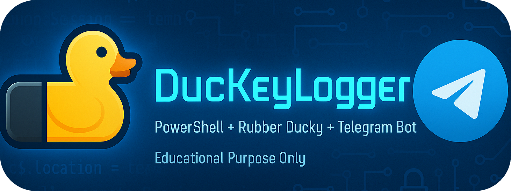
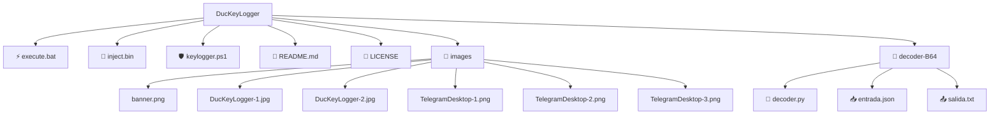

# :duck: DucKeyLogger — Keylogger usando un USB Rubber Ducky de Hack5 :keyboard: - Herramienta Educativa de Ciberseguridad :mortar_board::shield:

> [!IMPORTANT]
> **Lea cuidadosamente toda la documentación del repositorio, incluyendo la [LICENCIA](LICENSE) y [README](README.md), para evitar el incumplimiento de normativas legales y éticas, ya que el uso no autorizado de esta herramienta puede violar leyes locales e internacionales de ciberseguridad.**



> [!WARNING]  
> **Aviso legal y ético**: Este proyecto está diseñado **exclusivamente** para fines educativos, de auditoría y de concienciación en ciberseguridad, en **entornos controlados**, de **laboratorio** y siempre con el **permiso explícito, previo y documentado** de todas las partes implicadas.  
>  
> El uso de keyloggers o técnicas similares en sistemas de terceros **sin autorización** puede constituir un **delito**, sancionable administrativa y/o penalmente según la legislación vigente en tu país.  
>  
> Al utilizar este material te comprometes a:  
> - Emplearlo **solo** en equipos y cuentas **propias** o en aquellos para los que dispongas de un **consentimiento explícito por escrito**.  
> - No utilizarlo para **espiar**, **robar credenciales**, **suplantar identidades** o causar cualquier tipo de **daño**.  
> - Respetar siempre las **leyes**, los **códigos de conducta profesionales** y los **principios éticos** de la ciberseguridad (responsible disclosure, mínima intrusión, protección de la privacidad, etc.).  

## 🧭 Descripción del proyecto
**DucKeyLogger** es una herramienta educativa de ciberseguridad que combina la capacidad de inyección USB del Rubber Ducky con un keylogger en PowerShell, capturando pulsaciones del teclado y enviándolas ofuscadas a un bot de Telegram para su posterior decodificación mediante scripts Python, sirviendo como demostración práctica de vectores de ataque y técnicas de exfiltración de datos en entornos controlados para fines educativos y de investigación en seguridad informática.

El repositorio incluye materiales y guía visual para **demostrar** (de forma controlada) cómo podrían aparecer registros de eventos en un canal de Telegram, así como el **proceso de exportación** de dichos mensajes para su análisis forense.

> [!CAUTION]
> Como autor de este proyecto **no me hago responsable** de cualquier uso indebido, ilegal o malintencionado que se haga del mismo.

## 🎯 Objetivos educativos
- Concienciar sobre los riesgos de registrar entradas de teclado y su envío a terceros.
- Explicar un **flujo de trabajo de auditoría**: desde la aparición de mensajes en Telegram hasta su **exportación** a **JSON** para su análisis.
- Reforzar **buenas prácticas defensivas** y controles de seguridad.

## 🔧 Requisitos mínimos (entorno de laboratorio seguro)
- Cuenta de Telegram y un bot creado con **@BotFather**.
- **Telegram Desktop** para exportar el chat.
- Un **USB Rubber Ducky**, por ejemplo el de Hack5 (se puede ejecutar manualmente, usando execute.bat).

## 🧩 Generación de Payload

Para compilar el script Ducky y generar tu propio archivo [`inject.bin`](inject.bin) para tu Rubber Ducky, utiliza nuestra utilidad de codificación local:

[**🎯 Pincha aquí para abrir el Ducky Encoder**](https://schlomo.github.io/rubber-ducky-german/)

> [!NOTE]  
> **Créditos:** El Ducky Encoder es propiedad de [schlomo/rubber-ducky-german](https://github.com/schlomo).

Una vez abierto en tu navegador, sigue las instrucciones en la herramienta para codificar tu script y descargar el archivo `inject.bin` listo para usar en la microSD de tu Rubber Ducky.
## 🗂️ Exportar el chat a JSON (Telegram Desktop)
1. Abre Telegram Desktop y entra en el chat del bot.
2. Abre el menú **⋯** → **Export chat history** / **Exportar historial del chat**.
3. Elige **Machine‑readable JSON** como formato de exportación.
4. Confirma y espera el mensaje de **éxito**. Obtendrás un archivo `.json` para su análisis.

## :incoming_envelope: Pasos para la decodificación de mensajes de Base64 a lenguaje humano  
1) Exporta la conversación desde **Telegram Desktop** en formato **Machine-readable JSON**.  
2) Copia el archivo exportado como `decoder-B64/entrada.json`.  
3) Ejecuta el traductor para generar `decoder-B64/salida.txt`.

## 📸 Guía visual del Bot de Telegram

### Bienvenida del DucKeyLoggerBot y el recibimiento de mensajes codificados en Base64
<!-- Dos imágenes en la misma fila -->
<table>
  <tr>
    <td width="50%">
      
      <p align="center"><em>Mensaje de bienvenida de DucKeyLoggerBot</em></p>
    </td>
    <td width="50%">
      
      <p align="center"><em>Ejemplos del chat mensajes en Base64 (censurados)</em></p>
    </td>
  </tr>
</table>

### Fases de la exportación del chat del DucKeyLoggerBot en formato JSON
<!-- Tres imágenes en la misma fila -->
<table>
  <tr>
    <td width="33%">
      
      <p align="center"><em>Paso 1 – Abrir exportación</em></p>
    </td>
    <td width="33%">
      
      <p align="center"><em>Paso 2 – Elegir JSON</em></p>
    </td>
    <td width="33%">
      
      <p align="center"><em>Paso 3 – Éxito de exportación</em></p>
    </td>
  </tr>
</table>

## 🔎 Estructura del proyecto con todos sus archivos

```
DucKeyLogger/
├── ⚡ execute.bat              # Ejecutable en Windows manual (si no tenemos USB Rubber Ducky)
├── 🦆 inject.bin               # Payload compilado para la SD del USB Rubber Ducky
├── 🛡️ keylogger.ps1            # PoC educativa de registro de pulsaciones (keylogger)
├── 📝 README.md                # Descripción y notas del proyecto
├── 📜 LICENSE                  # Licenica de uso con sus terminos y condiciones del software
├── 📂 images/
│   ├── banner.png
│   ├── DucKeyLogger-1.jpg
│   ├── DucKeyLogger-2.jpg
│   ├── TelegramDesktop-1.png
│   ├── TelegramDesktop-2.png
│   └── TelegramDesktop-3.png
└── 📂 decoder-B64/             # Traductor de Base64 a texto humano legible
    ├── 🐍 decoder.py           # Script de decodificación Base64
    ├── 📥 entrada.json         # Archivo JSON al exportar el chat del Bot de telegram
    └── 📤 salida.txt           # Salida generada por el traductor (decoder.py) en lenguaje humano
```


**Resultado ejemplo de (`salida.txt`):**
```

DucKeyLogger ACTIVADO - 11/18/2025 16:57:46
CAMBIO DE APLICACIÓN: Outlook - Bandeja de entrada -> Bloc de notas - notas.txt
NUEVA VENTANA: Bloc de notas - notas.txt - notas.txt
[VS Code] escribiendo: "mensaje: revisa el mail, porfa"[ENTER]
CAMBIO DE APLICACIÓN: GitHub - Pull Requests -> Visual Studio Code
NUEVA VENTANA: Visual Studio Code - Edge
NUEVA VENTANA: Login - outlook.com - Brave
[mail.proton.me - Brave] username: harrypotter@proton.me
[mail.proton.me - Brave] password: Pa$$w0rd-XYZ
[mail.proton.me - Brave] Iniciar sesión [CLICK]
LOGIN: mail.proton.me | usuario=harrypotter@proton.me | resultado=success
NUEVA VENTANA: Login - github.com - Chrome
[github.com - Chrome] username: jacksparrow@gmail.com
[github.com - Chrome] password: S3gura!2025
[github.com - Chrome] Iniciar sesión [CLICK]
LOGIN: github.com | usuario=jacksparrow@gmail.com | resultado=success
CAMBIO DE APLICACIÓN: Visual Studio Code -> Explorador de archivos
NUEVA VENTANA: Explorador de archivos - Edge
NUEVA VENTANA: Nueva pestaña - Edge
[DuckDuckGo - Edge] tutorial receta tortilla de patata [ENTER]
NUEVA VENTANA: tutorial receta tortilla de patata - Buscar con DuckDuckGo - Edge
NUEVA VENTANA: Login - github.com - Edge
```

## 🛡️ Buenas prácticas y mitigación

### Para usuarios y administradores de sistemas:
- **Control de dispositivos USB**: Implementar políticas de restricción de dispositivos USB no autorizados mediante Group Policy o soluciones EDR
- **Monitorización de procesos PowerShell**: Configurar logging ampliado de PowerShell y monitorizar ejecuciones sospechosas con herramientas como Sysmon
- **Principio de mínimo privilegio**: Ejecutar sesiones de usuario con privilegios limitados, sin acceso administrativo innecesario
- **Segmentación de red**: Restringir conexiones salientes a servicios externos como Telegram API desde equipos críticos
- **Educación en concienciación**: Capacitar usuarios sobre riesgos de conectar dispositivos USB desconocidos y técnicas de ingeniería social

### Para desarrolladores y equipos de seguridad:
- **Análisis estático de código**: Implementar escaneo de scripts PowerShell en entornos de desarrollo y producción
- **Firmado de scripts**: Requerir que todos los scripts PowerShell estén firmados digitalmente para su ejecución
- **Detectores de keyloggers**: Utilizar herramientas especializadas que monitorizan hooks de teclado y procesos sospechosos
- **Hardening de estaciones de trabajo**: Aplicar configuraciones seguras que limiten capacidades de scripting no autorizadas

### Medidas técnicas específicas:
- **Windows Defender Application Control**: Configurar políticas que restrinjan ejecución de scripts no autorizados
- **AppLocker/Software Restriction Policies**: Bloquear ejecución de PowerShell en ubicaciones no permitidas
- **Network Monitoring**: Detectar tráfico hacia APIs de Telegram u otros servicios de exfiltración
- **Endpoint Detection and Response (EDR)**: Implementar soluciones que alerten sobre comportamientos de keylogging

> [!TIP]
> ⭐ **¿Te gusta este proyecto?** Si te resultó útil para aprender sobre ciberseguridad, ¡dale una **estrella** al repositorio! Tu apoyo ayuda a crecer la comunidad educativa.
  
## 📜 Licencia
Uso educativo. Verifica restricciones legales de este software en [LICENSE](LICENSE) antes usar cualquier material de este repositorio.

**📋 Resumen de Términos Clave:**
- ✅ **Uso Permitido:** Educación, investigación autorizada, pruebas en sistemas propios
- ❌ **Uso Prohibido:** Actividades maliciosas, acceso no autorizado, vigilancia ilegal
- ⚠️ **Responsabilidad:** El usuario asume toda la responsabilidad por el uso de este software
- 📍 **Cumplimiento Legal:** Verifica las restricciones legales de tu país/organización antes de usar cualquier material

> [!IMPORTANT]  
> **📢 Declaración Importante:**
> El autor **no se hace responsable** del uso indebido, malintencionado o ilegal de este software. El uso de estas herramientas sin autorización explícita puede violar leyes locales e internacionales.
